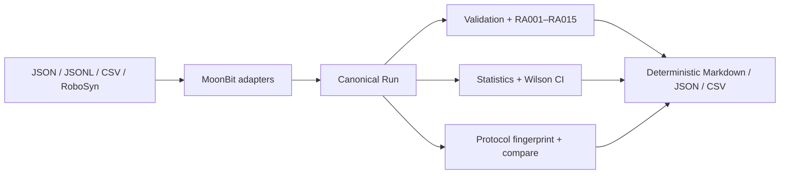

# RoboAudit.mbt

RoboAudit.mbt is a MoonBit-first native CLI for turning robot and embodied-AI episode logs into auditable, reproducible evaluation evidence.

It answers the question behind a leaderboard number: **can this result be trusted, reproduced, and compared?** A single command recalculates the evidence, identifies disclosure gaps with stable rule IDs, and produces a reviewable report without uploading experiment data.

## Problem

A single success rate cannot show whether evaluation seeds were duplicated, candidates were skipped, attempts were retried, artifacts were verified, or two runs used comparable protocols. RoboAudit recalculates results from episode records and surfaces those missing disclosures with stable rule identifiers.

## Features

- Canonical JSON, JSONL episode streams, simple unquoted CSV, and RoboSyn-style `evaluation_metrics.json` aliases.
- Deterministic Markdown, JSON, and CSV reports.
- Recomputed success counts and rates, Wilson 95% confidence intervals, action-step groups, failure counts/proportions, stage funnels, and skipped reasons.
- RA001 through RA015 audit rules, including retry disclosure, protocol mismatches, seed overlap, and artifact verification evidence.
- SHA-256 protocol fingerprints, sorted file manifests, and direct file verification using a binary-safe pure MoonBit implementation.
- 100 automated tests, native release benchmarks, CI, golden report hashes, and synthetic/anonymized fixtures.
- Windows and Ubuntu CI exercise the same native library, CLI, fixtures, and exit-code contract.

Input CSV intentionally supports only simple unquoted fields. Use JSON or JSONL when values contain commas or embedded newlines. No models, videos, raw datasets, simulator assets, credentials, or unknown-license content are included.

## Quick start

```powershell
moon fmt --check
moon info
moon check --target native
moon test --target native
moon build --target native
moon run --target native cmd/main -- report examples/minimal/canonical-clean.json
moon run --target native cmd/main -- report examples/minimal/canonical-clean.json --format json
moon run --target native cmd/main -- --version
```

## Commands

```text
roboaudit validate <file>
roboaudit summarize <file>
roboaudit audit <file>
roboaudit compare <file-a> <file-b>
roboaudit report <file>
roboaudit report-json <file>
roboaudit report-csv <file>
roboaudit fingerprint <file>
roboaudit manifest <paths...>
roboaudit verify-file <path> <sha256>
```

`report <file> --format json|csv|markdown` is supported alongside the `report-json` and `report-csv` shortcuts.

`validate` and `audit` print `valid` or stable `RAxxx` findings and exit with status 1 when findings exist. Invalid usage exits 2; missing files and parsing failures are also non-zero. `summarize` and `report-json` emit structured JSON; `report` emits Markdown. A non-empty `skipped` list is deliberately flagged so a success rate cannot conceal excluded candidates.

## Examples

```powershell
# Valid canonical input and a Markdown report
moon run --target native cmd/main -- report examples/minimal/canonical-clean.json

# Deliberately malformed input; expected exit status is 1
moon run --target native cmd/main -- validate examples/minimal/audit-findings.json

# Refuses to report a success-rate delta across incompatible observations
moon run --target native cmd/main -- compare examples/incompatible-protocols/pure-observation.json examples/incompatible-protocols/public-pose.json

# Run the complete narrated demo
powershell -ExecutionPolicy Bypass -File hackathon/demo.ps1
```

## Schema and audit rules

The public MoonBit model consists of `Run`, `Episode`, `Stage`, `ArtifactRef`, and `AuditFinding`. Missing source fields remain optional or use an explicit `unspecified` fallback. See the [canonical schema](docs/schema.md), [RA001–RA015 catalogue](docs/audit-rules.md), and [positive/negative rule matrix](docs/test-matrix.md).

## Architecture

All parsing, normalization, validation, statistics, protocol comparison, hashing, and rendering live in MoonBit. `cmd/main` only supplies native argument handling and file I/O. See [architecture](docs/architecture.md).



## Tests and performance

The native suite contains 100 tests, including malformed/non-finite input, adapter aliases, statistical boundaries, every audit rule, deterministic output, golden hashes, and SHA-256 vectors. The 2026-09-19 MoonBit coverage summary reports 778/824 instrumented lines (94.42%) in the core `roboaudit.mbt` file and 831/963 (86.29%) overall; the CLI entrypoint is exercised out of process and is explicitly excluded from the core figure. Run `moon test --target native`; see the [test matrix](docs/test-matrix.md) and measured 1,000-episode [benchmark evidence](benchmarks/README.md).

For a short, evidence-backed walkthrough of why an apparently perfect score may still be unsafe to compare, see the [audit case study](docs/case-study.md).

## September 2026 Hackathon work

Before this work, the repository was only a compiling MoonBit skeleton and contained no audit implementation. The September work built the canonical model, four input shapes, three report formats, RA001–RA015, protocol-safe comparison, manifests, 100 tests, CI, benchmarks, fixtures, documentation, and the runnable Demo. The pre-existing RoboSynChallenge project is used only as a read-only requirements source and is not included or claimed as hackathon work.

## AI assistance and provenance

AI assisted implementation, tests, documentation, and troubleshooting; the contributor remains responsible for review, explanation, quality, and publication. Only hand-written synthetic/anonymized fixtures and aggregate metadata evidence are committed. See [AI assistance](docs/ai-assistance.md), [provenance policy](docs/provenance.md), and [reference evidence](docs/reference-evidence.md).

## Roadmap

- Publish v0.1.0 after the contributor creates the public repository, signs in to Mooncakes, and approves the external release operations.
- Add quoted RFC 4180 CSV input only if real users need it; current simple CSV scope stays explicit.
- Explore a MoonBit WASM report viewer after the native P0/P1 release, reusing the same core logic.

## Documentation

- [Architecture](docs/architecture.md)
- [Canonical schema](docs/schema.md)
- [Audit rules](docs/audit-rules.md)
- [Audit-rule test matrix](docs/test-matrix.md)
- [Reproducibility](docs/reproducibility.md)
- [Reference evidence](docs/reference-evidence.md)
- [Audit case study](docs/case-study.md)
- [Provenance and safe-data policy](docs/provenance.md)
- [AI assistance](docs/ai-assistance.md)
- [Native benchmark evidence](benchmarks/README.md)
- [Runnable demo](hackathon/demo-script.md)
- [Submission requirements matrix](hackathon/requirements-matrix.md)

Protocol protection can be demonstrated with `examples/incompatible-protocols/`; skipped candidate and retry disclosure is demonstrated by `examples/minimal/skipped-and-retries.json`.

## License

Apache-2.0. See [LICENSE](LICENSE) and [NOTICE](NOTICE).
